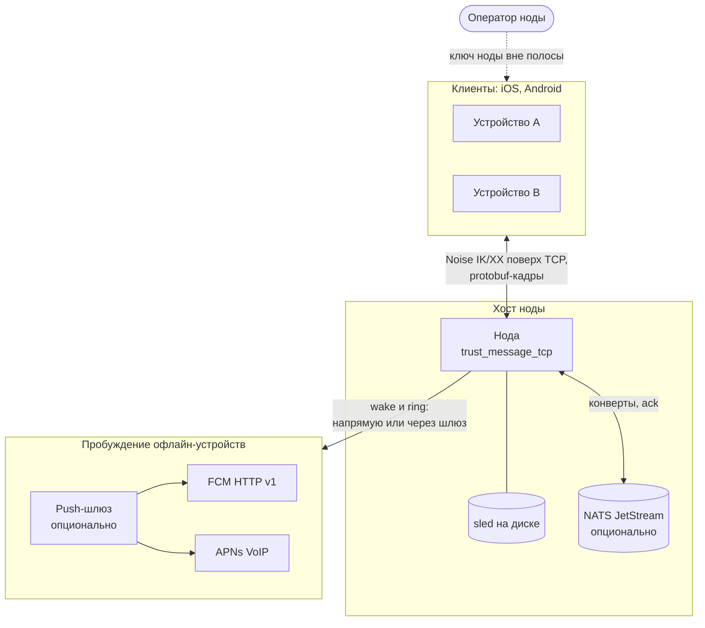
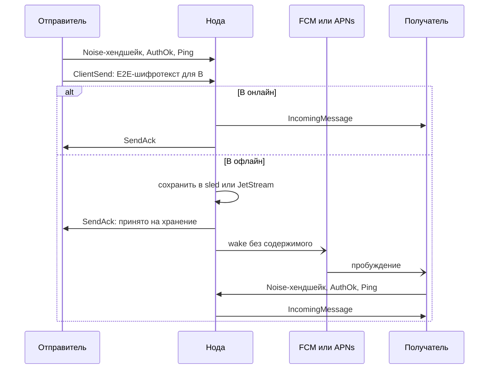

# trust_message_tcp

[](https://github.com/Darkildo/trustme_backend/actions/workflows/ci.yml)
[](https://github.com/Darkildo/trustme_backend/actions/workflows/audit.yml)
[](LICENSING.md)

Серверная нода мессенджера с end-to-end шифрованием, на Rust.

- **Канал.** Клиенты подключаются по TCP, канал шифрует Noise:
  `Noise_IK_25519_ChaChaPoly_BLAKE2s` для клиента с пином ключа ноды,
  `Noise_XX_25519_ChaChaPoly_BLAKE2s` для первого контакта. TLS, паролей
  и токенов нет: identity клиента — его Ed25519-ключ.
- **Маршрутизация.** Нода пересылает непрозрачные E2E-конверты между
  пользователями и их устройствами. Тело сообщения она не расшифровывает.
- **Хранение.** Недоставленное лежит локально в `sled` или в NATS
  JetStream с подтверждением доставки.
- **Пробуждение.** Офлайн-устройства будятся push-уведомлениями без
  содержимого: FCM, APNs VoIP для звонков или внешний push-шлюз.
- **Протокол.** Кадры внутри канала — protobuf. Схемы в
  [`schemas/`](schemas/) — единственный источник правды для кода.

## Как это работает



Путь сообщения от A к B:



1. Клиент заранее знает ключ ноды (IK) или узнаёт его на первом контакте
   (XX). Хендшейк доказывает ноде, что клиент владеет ключом аккаунта
   или сертификатом устройства, подписанным этим ключом.
2. Сессию открывает первый кадр клиента после `AuthOk`, обычно `Ping`.
   До него нода ничего не доставляет.
3. Отправитель шлёт E2E-шифротекст. Нода видит отправителя, получателя
   и метаданные, но не тело.
4. Онлайн-получатель получает сообщение сразу. Для офлайн-получателя оно
   сохраняется, а его устройства будятся пушем без содержимого и
   забирают сообщение при подключении.

Подробные схемы — [docs/architecture.md](docs/architecture.md):
- компоненты ноды;
- жизненный цикл соединения и хендшейк IK/XX;
- доставка на `sled` и на JetStream;
- конвейер пушей;
- развёртывание;
- кто что видит.

## Модель безопасности

Что обеспечивает нода. Канал клиент ↔ нода — Noise поверх TCP; TLS не
используется. Identity клиента — его Ed25519-ключ (`user_id`): нода
конвертирует заявленный в хендшейке ключ в X25519 и сверяет с
аутентифицированным Noise-статиком, поэтому выдать себя за другого
пользователя без его секрета нельзя; паролей и токенов в протоколе нет.
Ключи малого порядка (identity клиента, транспортный ключ и ключ-подписант
сертификата устройства) отвергаются на хендшейке. Сессия открывается
только первым кадром клиента после `AuthOk`: прислать его может лишь
владелец эфемерного ключа хендшейка.
Нода аутентифицируется своим X25519-статиком: в IK клиент обязан знать его
заранее (пин, раздаётся вне полосы); в XX клиент получает ключ в ходе
хендшейка и решает, доверять ли ему (TOFU). Статик ноды малого
порядка клиент обязан отвергать сам: эталонный инициатор делает это до
первого байта в IK и до решения о доверии в XX. Магия, версия протокола и
выбранный паттерн входят в Noise prologue, поэтому подмена версии или
переключение клиента с пином на XX ломает хендшейк. Снапшот конфигурации
ноды подписан Ed25519-ключом, из которого выводится её статик; подпись
доменно разделена и имеет срок действия. Делегированный вход по сертификату
устройства ограничен битами прав и сроком. Тело сообщения нода не
расшифровывает и не разбирает; push-уведомления не содержат тела.
Квоты, rate-limit'ы, лимиты входа и потолок открытых соединений
ограничивают расход ресурсов ноды (best-effort; счётчики rate-limit живут
в памяти и сбрасываются рестартом).

Чего нода не обеспечивает. E2E-шифрование тела выполняют клиенты; эта
криптография вне репозитория. Нода видит метаданные: `user_id` и `deviceId`
отправителя и получателя, размеры, время, приоритет и признак звонка, IP
клиентов. Провайдер push видит push-токен и время пробуждений; в FCM-wake
и в запросе к push-шлюзу едут также `user_id` получателя и `deviceId`,
VoIP-пуш APNs их не содержит. Хранилище на диске не шифруется (конверты
лежат как пришли: E2E-шифротекст плюс метаданные в открытом виде), секрет
ноды — hex-файл, создаваемый сразу с правами `0600`. В логи на уровне
`info` (по умолчанию) записи о каждом сообщении и IP каждого соединения
не попадают: там сводка сессии, отказы и ошибки, причём строки отказов
доставки содержат идентификаторы отправителя и получателя. `RUST_LOG=debug`
добавляет построчные записи о сообщениях (отправитель, получатель, размер)
и IP соединений. TOFU не защищает от активного MITM в момент первого
контакта (`NOISE_ALLOW_TOFU=false` отключает этот путь). Payload первого сообщения
IK (identity клиента, `deviceId`, сертификат устройства) зашифрован на
статик ноды без forward secrecy, и это сообщение может быть переиграно:
на повтор нода отвечает msg2 и `AuthOk`, но ничего не регистрирует, не
доставляет и не дренирует; повтор лишь держит место на входе
(`LIMIT_HANDSHAKE_INFLIGHT*`) не дольше `SESSION_CONFIRM_TIMEOUT_SECS`.
Трафик после хендшейка forward secrecy имеет. Нода может задерживать или
не отдавать сообщения; сертификаты устройств не отзываются до истечения
срока, а сессия по сертификату закрывается в момент его истечения.
Подробности — разделы 5 и 12 [server-contract.md](server-contract.md).

## Спецификация протокола

- [server-contract.md](server-contract.md) — контракт ноды на проводе:
  хендшейк, кадрирование, словарь кадров, семантика отправки и доставки,
  push, лимиты, ограничения.
- [docs/architecture.md](docs/architecture.md) — устройство ноды в схемах.
- [docs/protocol-schema.md](docs/protocol-schema.md) — правила эволюции
  схемы, версионирование, сертификат устройства.
- [docs/push-gateway.md](docs/push-gateway.md) — контракт ноды с внешним
  push-шлюзом.
- Схемы protobuf — единственный источник правды для кода:
  - [`schemas/trustmessage/wire/v1/wire.proto`](schemas/trustmessage/wire/v1/wire.proto) — клиент ↔ нода;
  - [`schemas/trustmessage/broker/v1/broker.proto`](schemas/trustmessage/broker/v1/broker.proto) — конверт в JetStream (внутренний);
  - [`schemas/trustmessage/push/v1/push.proto`](schemas/trustmessage/push/v1/push.proto) — нода → push-шлюз (gRPC).

Эталонная клиентская проверка подписанного конфига —
`net::framing::verify_signed_server_config`; эталонный инициатор
хендшейка — `NoiseFramed::connect` / `connect_unpinned` /
`connect_delegated` в `src/net/noise.rs`.

## Сборка и тесты

Требования: Rust toolchain с поддержкой edition 2024. `protoc` не нужен:
схемы компилирует `protox` в `build.rs`.

```bash
cargo build --release
cargo test --all-targets
cargo fmt --all --check
cargo clippy --all-targets -- -D warnings
```

Тесты брокерного тракта (`tests/jetstream_delivery.rs`,
`tests/jetstream_session_confirmation.rs`) требуют NATS с JetStream и
помечены `#[ignore]`, поэтому `cargo test` без флагов их не запускает:

```bash
nats-server -js -sd /tmp/nats-test &
TRUST_MESSAGE_TEST_NATS_URL=nats://127.0.0.1:4222 \
TRUST_MESSAGE_TEST_NATS_BIN=nats-server \
  cargo test --test jetstream_delivery -- --ignored --test-threads=1
cargo test --test jetstream_session_confirmation -- --ignored --test-threads=1
```

- `TRUST_MESSAGE_TEST_NATS_URL` — адрес брокера, по умолчанию
  `nats://127.0.0.1:4222`.
- `TRUST_MESSAGE_TEST_NATS_BIN` — путь к бинарю `nats-server`; нужен тесту,
  который сам поднимает и останавливает брокер (без переменной этот тест
  падает). CI использует релиз nats-server v2.12.6.
- `--test-threads=1` обязателен: все тесты используют один поток JetStream
  (два потока не могут делить subject).

Проверка схем (нужен [`buf`](https://buf.build)):

```bash
cd schemas && buf lint
cd schemas && buf breaking --against '../.git#branch=master,subdir=schemas'
```

Фаззинг разборщиков недоверенных байт (нужны nightly и `cargo-fuzz`):

```bash
cargo +nightly fuzz run frame_decode           # разбор Frame
cargo +nightly fuzz run chunk_framing          # сборка логических кадров из Noise-чанков
cargo +nightly fuzz run client_hello           # payload хендшейка (до проверки identity)
cargo +nightly fuzz run signed_server_config   # проверка подписанного конфига
```

Покрытие изменённых строк (гейт CI, порог 70%):

```bash
cargo llvm-cov --all-targets --json --output-path coverage.json \
  -- --include-ignored --test-threads=1
python3 scripts/coverage-gate.py coverage.json origin/master --min 70
```

CI (`.github/workflows/`): fmt, clippy, тесты, брокерные тесты под живым
NATS, `buf lint`/`buf breaking`, покрытие диффа, минутный фаззинг каждого
таргета; ночной фаззинг — `nightly-fuzz.yml`; `cargo audit` по базе
RustSec на каждом PR и раз в сутки — `audit.yml`. Сторонние actions
закреплены SHA коммита; обновления actions и cargo-зависимостей приходят
от dependabot pull request'ами в ветку `dev`.

## Структура репозитория

| Путь | Содержимое |
|---|---|
| `src/main.rs` | Загрузка конфигурации, ключа ноды, хранилища; запуск listener'а |
| `src/config.rs` | Конфигурация из `.env` и переменных окружения |
| `src/net/noise.rs` | Noise-хендшейк (IK/XX), ключ ноды, кадрирование поверх Noise |
| `src/net/device_cert.rs` | Проверка сертификата устройства (делегированный вход) |
| `src/net/framing.rs` | Кодирование кадров, подписанный `ServerConfig` и его проверка |
| `src/net/conn.rs` | Жизненный цикл сессии, маршрутизация, отказы |
| `src/net/listener.rs` | Accept-цикл, допуск на хендшейк |
| `src/net/rate_limit.rs` | Rate-limit отправки, лимит Ping, лимит одновременных хендшейков |
| `src/delivery/` | Бэкенды доставки: прямой (sled) и JetStream |
| `src/state/` | Хранилище sled: офлайн-очереди, push-токены, состояние планировщика пушей, реестр очередей, реестр сессий |
| `src/push/` | Планировщик пушей, транспорты FCM HTTP v1, APNs VoIP, gRPC-клиент push-шлюза |
| `src/domain/` | Доменные типы: приоритет, причины отказа, wake-подсказка |
| `src/observability.rs` | Логи и Prometheus-метрики |
| `schemas/` | protobuf-схемы (buf-модуль) |
| `build.rs` | Генерация Rust-кода из схем (`protox` + `prost-build` + `tonic-prost-build`) |
| `tests/` | Интеграционные тесты через настоящий Noise-канал на loopback |
| `fuzz/` | Таргеты `cargo-fuzz`, словарь и сиды |
| `examples/` | `e2e_smoke` (сценарии против живой ноды), `load_gen` (нагрузка), административные утилиты push |
| `deploy/` | Образы, compose-override для JetStream, правила алертов, мониторинг, скрипты бэкапа и восстановления |
| `docs/` | Эксплуатационная документация (см. ниже) |

## Запуск

```bash
cargo run --release -- --port 5000
```

При первом старте нода генерирует ключ в `STORAGE_PATH/node_identity_key`
и печатает в лог `node_key=<hex>` — X25519-статик, который нужен клиентам
для IK.

Docker:

```bash
docker build -t trust_message_tcp:local .
docker run --rm \
  -p 5000:5000 -p 127.0.0.1:9000:9000 \
  -e BIND_PORT=5000 -e METRICS_ENABLED=true \
  -v "$(pwd)/data:/srv/trust-message/data" \
  trust_message_tcp:local
```

[compose.yaml](compose.yaml) поднимает ноду вместе с NATS JetStream
(`DELIVERY_BACKEND=jetstream`): протокол на порту 5000, метрики — только на
`127.0.0.1:9000`. Брокер — nats 2.12.6 с тем же конфигом, что на проде
([deploy/nats/nats.conf](deploy/nats/nats.conf), в нём `max_payload`).

Клиент после `AuthOk` обязан сразу отправить кадр (рекомендуется `Ping`):
до него нода сессию не открывает и через `SESSION_CONFIRM_TIMEOUT_SECS`
закрывает соединение — см. [server-contract.md](server-contract.md) §5.

## Конфигурация

Источники: файл `.env` в рабочем каталоге (INI-формат) и переменные
окружения; переменные окружения имеют приоритет. Обязательных параметров
нет. Шаблон — [.env.example](.env.example). CLI: `--addr`/`--bind-addr <host:port>`, `--host <host>`,
`--port <port>` (также в форме `--port=5000`) перекрывают адрес бинда.
Уровень логов — `RUST_LOG` (по умолчанию `info,sled::config=off`).

Сеть, ключ, протокол:

| Переменная | По умолчанию | Смысл |
|---|---|---|
| `BIND_ADDR` | — | `host:port`; приоритетнее `BIND_HOST`/`BIND_PORT` |
| `BIND_HOST` | `0.0.0.0` | |
| `BIND_PORT` | `443` | |
| `STORAGE_PATH` | `data` | Каталог sled и файла ключа ноды |
| `NODE_IDENTITY_KEY` | — | Секрет ноды: Ed25519 seed, 64 hex-символа. Перекрывает файл `STORAGE_PATH/node_identity_key`. См. [docs/runbook-node-key.md](docs/runbook-node-key.md) |
| `NOISE_HANDSHAKE_TIMEOUT_MS` | `10000` | Потолок времени на хендшейк; `0` запрещён |
| `SESSION_CONFIRM_TIMEOUT_SECS` | `30` | Сколько нода ждёт первый кадр клиента после `AuthOk`; без него соединение закрывается. До подтверждения соединение держит место в `LIMIT_HANDSHAKE_INFLIGHT*`. `0` запрещён |
| `NOISE_ALLOW_TOFU` | `true` | Принимать ли XX (первый контакт). `false` — только клиенты с пином |
| `MAX_FRAME_LEN` | `8388608` | Максимальный логический кадр, байт. Потолок тела сообщения — на 128 байт меньше; тело длиннее отклоняется с `TOO_LARGE` |
| `SERVER_CONFIG_TTL_SECONDS` | `86400` | Срок жизни подписанного снапшота; `0` запрещён |
| `ADVERTISED_ADDRESS` | — | `host:port` в подписанном снапшоте; пусто — нода адрес не объявляет |
| `DEVICE_CERT_MAX_TTL_SECONDS` | `2592000` (30 сут) | Потолок срока сертификата устройства; `0` выключает делегированный вход |
| `QUEUE_ADDRESSING_ENABLED` | `false` | Адресация депозита по `queueId` |
| `TCP_KEEPALIVE_SECS` | `60` | Простой соединения до первой TCP keepalive-пробы, с; `0` выключает keepalive. Не больше 32767 |
| `TCP_KEEPALIVE_INTERVAL_SECS` | `15` | Интервал между неотвеченными пробами, с (1–32767) |
| `TCP_KEEPALIVE_RETRIES` | `4` | Сколько неотвеченных проб рвут соединение (1–127). С дефолтами мёртвый пир обнаруживается примерно за 60 + 4 × 15 = 120 с |
| `METRICS_ENABLED` | `false` | Включается автоматически, если задан `METRICS_ADDR` |
| `METRICS_ADDR` | `0.0.0.0:9000` | Адрес Prometheus-экспортера |

Хранение и доставка:

| Переменная | По умолчанию | Смысл |
|---|---|---|
| `OFFLINE_MESSAGES_RETENTION` | `30d` | Срок хранения офлайн-очередей (`inbox`, `device_inbox`) |
| `DELETED_MESSAGES_RETENTION` | `30d` | Срок хранения архива `meta` |
| `DELIVERY_BACKEND` | `sled` | `sled` — прямой бэкенд; `jetstream` — доставка через NATS JetStream с `DeliveryAck` |
| `NATS_URL` | `nats://nats:4222` | |
| `NATS_STREAM_NAME` | `messages` | |
| `NATS_ACK_WAIT_SECS` | `30` | Через сколько неподтверждённый конверт передоставляется |
| `NATS_STREAM_MAX_AGE_DAYS` | `14` | Максимальный возраст записи в потоке |
| `NATS_STREAM_MAX_BYTES` | `367001600` (350 MiB) | Объём потока. Политика `discard: new`: при заполнении новый конверт получает `FULL`, принятые не вытесняются. Считается только недоставленное |
| `NATS_MAX_MSGS_PER_SUBJECT` | `10000` | Потолок ящика получателя, конвертов: subject аккаунта и каждый subject устройства считаются отдельно. Сверх — `FULL`. Только больше `0` |
| `NATS_CONSUMER_INACTIVE_THRESHOLD_DAYS` | `30` | Удаление неактивных durable-consumer'ов; обязан быть больше `NATS_STREAM_MAX_AGE_DAYS` |
| `NATS_PUBLISH_TIMEOUT_MS` | `2000` | Ожидание подтверждения публикации |

Значения retention: число дней (`30`, `30d`), `disabled` (синонимы `off`,
`none`, `false`, `infinite`) — записи не удаляются по сроку, `instant`
(`immediate`, `0`) — офлайн-сообщения не сохраняются.

Лимиты (`0` — без ограничения):

| Переменная | По умолчанию | Смысл |
|---|---|---|
| `TTL_MIN_SECONDS` | `86400` | Пол ненулевого `ClientSend.ttlSeconds`; ниже — `INVALID_TTL`. `0` отключает проверку |
| `QUOTA_MAX_MESSAGES_PER_QUEUE` | `10000` | Записей в одной офлайн-очереди (account и device считаются раздельно) |
| `QUOTA_MAX_BYTES_PER_QUEUE` | `67108864` (64 MiB) | Байт в одной офлайн-очереди |
| `QUOTA_MAX_MESSAGES_SENDER_PAIR` | `2000` | Записей одного отправителя в очереди получателя |
| `RATE_LIMIT_SEND_MSGS_PER_SEC` | `100` | `ClientSend` в секунду на пользователя (фиксированное окно) |
| `RATE_LIMIT_SEND_BYTES_PER_DAY` | `268435456` (256 MiB) | Байт отправки на пользователя за UTC-сутки |
| `LIMIT_MAX_SESSIONS_PER_USER` | `64` | Одновременных сессий пользователя; сверх — `AuthError 401` |
| `LIMIT_PING_PER_SEC` | `50` | `Ping` в секунду на соединение; сверх — `Pong` не отправляется |
| `LIMIT_HANDSHAKE_INFLIGHT` | `256` | Одновременных хендшейков на ноду (включая соединения, ждущие подтверждения сессии) |
| `LIMIT_HANDSHAKE_INFLIGHT_PER_IP` | `32` | Одновременных хендшейков с одного IP; за общим NAT поднимать |
| `LIMIT_MAX_CONNECTIONS` | `4096` | Открытых клиентских соединений на ноду, включая не прошедшие хендшейк; сверх — закрытие сразу после `accept`. Простаивающая сессия держит около 80 KiB буферов. Держать ниже `ulimit -n` с запасом |
| `MAX_QUEUES_PER_USER` | `1024` | Mailbox-очередей на пользователя |
| `MAX_PUSH_DEVICES_PER_USER` | `32` | Устройств с push-токенами на пользователя; новое устройство сверх — `PushTokenAck { ok: false }`, известное может обновлять токен |

Квоты очередей применяются только на прямом бэкенде; брокерный ограничен
потолком ящика `NATS_MAX_MSGS_PER_SUBJECT` и объёмом потока
`NATS_STREAM_MAX_BYTES`.

Push:

| Переменная | По умолчанию | Смысл |
|---|---|---|
| `PUSH_ENABLED` | `false` | Без него используется mock-транспорт |
| `PUSH_GATEWAY_URL` | — | Режим шлюза: кредов FCM/APNs на ноде быть не должно. Только `https://` (TLS проверяется системными корневыми сертификатами); `http://` — лишь для `127.0.0.0/8`, `::1`, `localhost`, иначе нода с `PUSH_ENABLED=true` не стартует. См. [docs/push-gateway.md](docs/push-gateway.md) |
| `PUSH_GATEWAY_TIMEOUT_MS` | `10000` | |
| `FCM_PROJECT_ID`, `FCM_SERVICE_ACCOUNT_PATH` | — | Обязательны при `PUSH_ENABLED=true` без шлюза |
| `PUSH_HTTP_TIMEOUT_MS` | `10000` | Таймаут запроса к FCM/APNs |
| `PUSH_MIN_GAP_{HIGH,MEDIUM,LOW,NONE}_MS` | `0` / `10000` / `60000` / `120000` | Минимальный интервал между пушами одному устройству по максимальному приоритету накопленного. Применяется с точностью до секунды с округлением вверх: ненулевое значение меньше секунды действует как 1 с |
| `PUSH_BURST_{HIGH,MEDIUM,LOW,NONE}` | `1` / `3` / `8` / `15` | Сколько накопленных сообщений будят досрочно |
| `PUSH_WAKE_ON_UNSPECIFIED` | `true` | `false` — сообщения без приоритета не будят по времени, только по burst или вместе с приоритетным |
| `PUSH_SUPPRESS_INITIAL_MS`, `PUSH_SUPPRESS_MAX_MS` | `30000`, `3600000` | Экспоненциальный backoff после ошибок провайдера |
| `PUSH_CHANNEL_CAPACITY` | `8192` | Очередь триггеров планировщика; при переполнении триггер отбрасывается |
| `PUSH_SEND_CONCURRENCY` | `32` | Сколько обращений к провайдеру (или шлюзу) идёт одновременно; отправки одному устройству строго последовательны. `0` действует как `1` |
| `APNS_ENABLED` | `false` | VoIP-пуши входящих звонков на iOS |
| `APNS_KEY_PATH`, `APNS_KEY_ID`, `APNS_TEAM_ID`, `APNS_BUNDLE_ID` | — | Обязательны при `APNS_ENABLED=true` |
| `APNS_ENVIRONMENT` | `production` | `production` или `sandbox` |
| `PUSH_RING_COOLDOWN_MS` | `3000` | Подавление повторного VoIP-ring того же устройства; применяется с точностью до миллисекунды |

## Хранилище

Деревья sled под `STORAGE_PATH`: `inbox` и `device_inbox` (офлайн-очереди
account- и device-scope), `queue_stats` (счётчики квот, пересчитываются при
старте), `meta` (архив удалённых из очереди), `system` (в том числе маркер
формата очередей), `device_push_tokens`, `push_welcome_claims` (отметки
выданного welcome-пуша), `push_state` (состояние троттлинга пушей),
`queues` и `queue_owner` (mailbox-очереди). При старте и затем раз в сутки
фоновая задача удаляет записи с истёкшим retention или `ttlSeconds`;
просроченное также отбрасывается лениво при чтении очереди. Запись,
которую не удалось разобрать, чистка пропускает и оставляет на месте
(warn в логе), не прерывая проход.

Формат офлайн-очередей — v5. Базу в формате v3 или v4 нода при старте
переписывает в v5 одной транзакцией вместе с маркером формата. На базе в
формате v1 или v2 нода не стартует и ничего в ней не меняет; варианты —
в [docs/runbook-failure-modes.md](docs/runbook-failure-modes.md).

## Эксплуатация

- [docs/deployment.md](docs/deployment.md) — развёртывание, решения до
  запуска, лимиты соединений, бэкапы, выкладка, обновление и откат.
- [docs/runbook-node-key.md](docs/runbook-node-key.md) — ключ ноды: бэкап,
  ротация, сигналы потери.
- [docs/runbook-metrics.md](docs/runbook-metrics.md) — метрики и алерты.
- [docs/runbook-failure-modes.md](docs/runbook-failure-modes.md) —
  поведение при отказе брокера, диска, часов, при рестарте и за NAT,
  при переполнении потока, нехватке дескрипторов и медленных получателях.

## Участие и безопасность

- [CONTRIBUTING.md](CONTRIBUTING.md) — как предложить изменение; pull
  request'ы принимаются после подписания [CLA](CLA.md).
- [SECURITY.md](SECURITY.md) — как приватно сообщить об уязвимости.

## Лицензия

Source-available: [PolyForm Strict License 1.0.0](LICENSE) с дополнительными
разрешениями из [LICENSING.md](LICENSING.md). Код можно читать, собирать и
запускать в некоммерческих целях. Аудит безопасности разрешён всем, в том
числе коммерческим организациям; изменения разрешены для подготовки pull
request'ов. Коммерческое использование, производные работы и форки вне этого
репозитория — по отдельной лицензии правообладателя.

Copyright (c) 2025-2026 Requiem.
