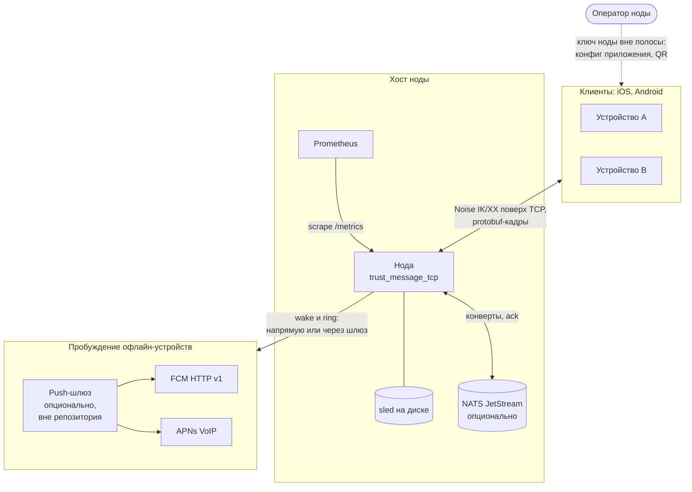
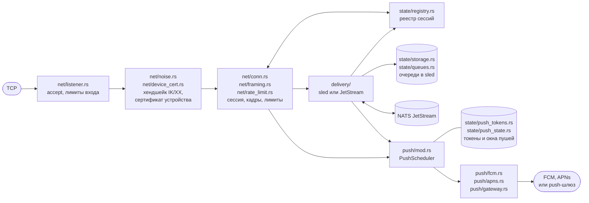
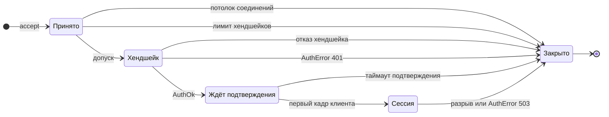
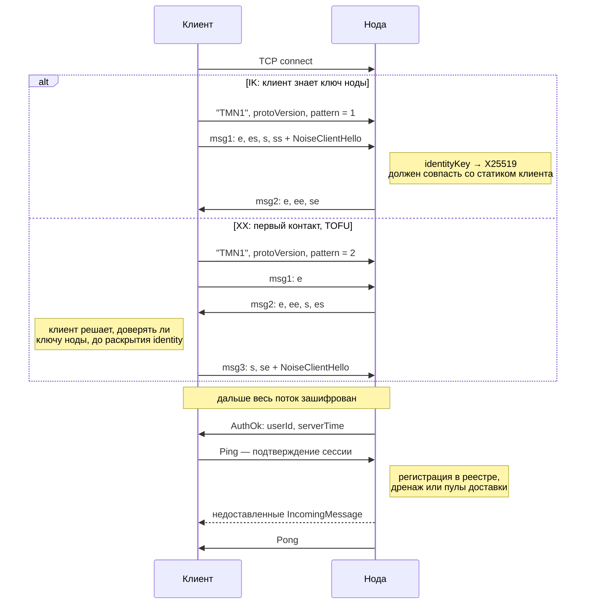
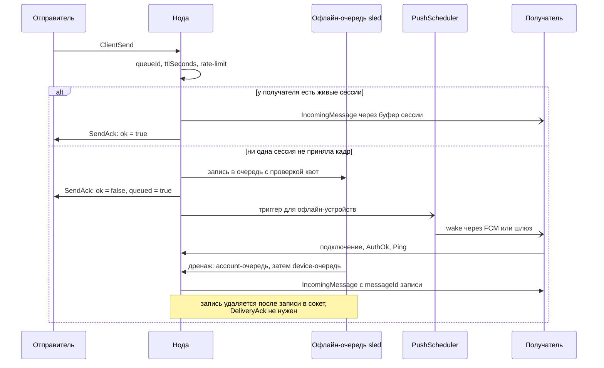
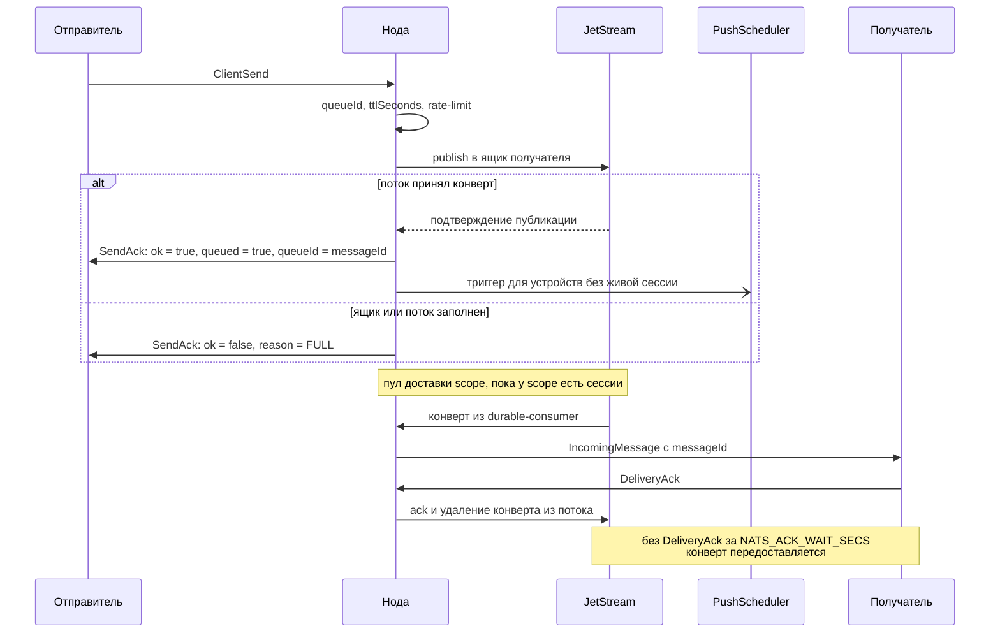
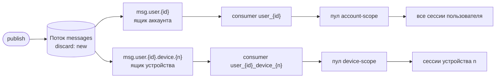
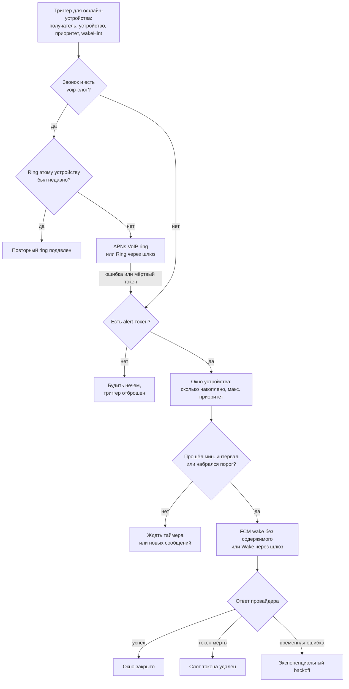
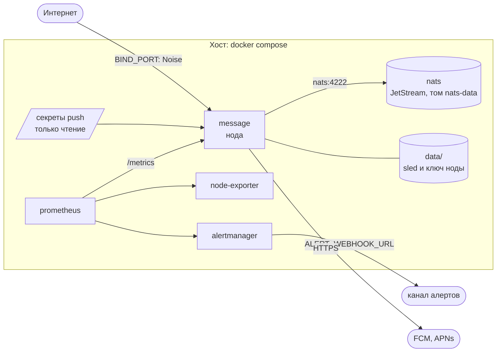
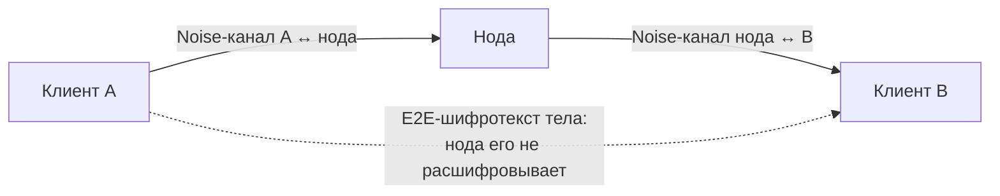

# Архитектура ноды

Карта того, как устроена нода и как через неё проходят соединение,
сообщение и пробуждение устройства. Документ обзорный: нормативное
поведение на проводе описано в [server-contract.md](../server-contract.md),
формат — в схемах [`schemas/`](../schemas/). Расхождение между этим
документом и контрактом — ошибка этого документа.

Схемы нарисованы на [Mermaid](https://mermaid.js.org/), GitHub рисует их
прямо в просмотре файла.

---

## 1. Система целиком

- Клиенты говорят с нодой по TCP. Канал шифрует Noise, TLS не
  используется. Identity клиента — его Ed25519-ключ, паролей и токенов в
  протоколе нет.
- Ключ ноды клиент получает до первого подключения, от оператора
  (паттерн IK), либо узнаёт в ходе хендшейка и решает, доверять ли ему
  (XX, TOFU).
- Недоставленное лежит в `sled` (бэкенд по умолчанию) или в потоке NATS
  JetStream (`DELIVERY_BACKEND=jetstream`).
- Push работает в одном из двух режимов: локальные креды FCM и APNs на
  ноде либо внешний push-шлюз, у которого креды владельца приложения.
  Смешивать режимы нельзя — это ошибка старта. Подробности —
  [push-gateway.md](push-gateway.md).

## 2. Компоненты ноды

- Пути на схеме — относительно `src/`.
- Каждое соединение обслуживает отдельная задача tokio. Она проводит
  хендшейк и дальше читает и пишет шифрованный кадровый поток.
- **Реестр сессий** — общая карта `пользователь → список сессий`. В
  записи — `deviceId` сессии и канал на запись в её сокет, до 1024
  кадров. Отправка ищет в реестре цели и кладёт кадр в их каналы.
- **DeliveryBackend** выбирается конфигурацией. Прямой бэкенд
  доставляет в живые сессии сам и складывает недоставленное в `sled`.
  Брокерный публикует всё в JetStream, а выдают конверты пулы доставки.
- **PushScheduler** — отдельная задача с ограниченной очередью триггеров:
  путь доставки на пушах не блокируется.
- Остальные модули (`config.rs`, `observability.rs`, `src/domain/`) —
  в таблице [структуры репозитория](../README.md#структура-репозитория).

## 3. Соединение: от TCP до сессии

- **Принято.** Соединение сверх `LIMIT_MAX_CONNECTIONS` закрывается сразу
  после `accept`. Дальше нужен допуск на хендшейк: не больше
  `LIMIT_HANDSHAKE_INFLIGHT` одновременно на ноду и
  `LIMIT_HANDSHAKE_INFLIGHT_PER_IP` с одного адреса.
- **Хендшейк.** Отказ — разрыв TCP без диагностики: не та магия или
  версия, неизвестный паттерн, XX при `NOISE_ALLOW_TOFU=false`, чужой
  статик ноды, `identityKey` не совпал со статиком, ключ малого порядка,
  таймаут. Лимит сессий пользователя проверяется до `AuthOk`: вместо него
  приходит `AuthError 401`.
- **Ждёт подтверждения.** После `AuthOk` нода ничего не доставляет и не
  считает соединение онлайн-устройством. Сессию открывает первый кадр
  клиента, обычно `Ping`: прислать расшифровываемый кадр может только
  владелец эфемерного ключа хендшейка. Так переигранный msg1 IK не
  получает ни сессии, ни сообщений. Без кадра соединение закрывается
  через `SESSION_CONFIRM_TIMEOUT_SECS`.
- **Сессия.** Сессия попадает в реестр, после чего дренируется
  офлайн-очередь (прямой бэкенд) или поднимаются пулы доставки
  (JetStream). Закрывается разрывом, `AuthError 503` (доставка недоступна),
  истечением сертификата устройства или, на прямом бэкенде, когда сессия
  не успевает читать.

## 4. Хендшейк

- Магия `TMN1`, версия протокола и байт паттерна идут открытым текстом, но
  входят в prologue Noise. Подмена любого из них разводит transcript'ы
  сторон, и хендшейк не сходится. Так закрыты downgrade версии и
  переключение клиента с пином на TOFU-путь.
- `NoiseClientHello` несёт `identityKey`, `deviceId` и, при делегированном
  входе, сертификат устройства. Нода конвертирует `identityKey` в X25519 и
  сверяет с аутентифицированным статиком. При входе по сертификату статик
  сверяется с `deviceCert.transportKey`.
- Payload msg1 в IK зашифрован на статик ноды без её эфемерала и потому
  не имеет forward secrecy. Транспортная фаза forward secrecy имеет.
- Ключ ноды — один Ed25519-seed. Из него выводятся X25519-статик для
  Noise и ключ подписи `SignedServerConfig` и запросов к push-шлюзу, так что
  пиннить клиенту нужно одну величину. Обращение с ключом —
  [runbook-node-key.md](runbook-node-key.md).

## 5. Доставка сообщения

Обе ветки начинаются одинаково. Нода принимает `ClientSend` и
проверяет его в фиксированном порядке:
1. разрешение `queueId`, если включена адресация по очередям;
2. пол `ttlSeconds`;
3. rate-limit отправителя.

Получатель — `recipientId` или владелец очереди. Account-scope сообщение
(без `recipientDeviceId`) уходит во все сессии пользователя, device-scope —
только сессиям этого устройства. Дальше ветки расходятся.

### 5.1. Прямой бэкенд (`sled`)

- Онлайн-доставка не ждёт чужой сокет: кадр кладётся в канал сессии без
  ожидания. Сессия с переполненным каналом выписывается из реестра и
  закрывается, а сообщение, не принятое ни одной сессией, уходит в
  очередь.
- Квоты очереди (`QUOTA_*`) действуют только на этом офлайн-пути. Упёршаяся
  квота даёт `SendAck` с `FULL`.
- `SendAck.ok` здесь значит «доставлено в живую сессию», а
  `ok = false, queued = true` — «принято в очередь».

### 5.2. Брокерный бэкенд (JetStream)

Ящики и пулы доставки:

- У каждого ящика свой durable pull-consumer. Пул доставки поднимается
  при подтверждении первой сессии scope и завершается, когда scope уходит
  в офлайн. Неподтверждённые конверты завершившегося пула сразу
  возвращаются потоку.
- Пул ждёт место в канале сессии и сессии не выписывает.
- `DeliveryAck` снимает конверт, только если его прислал получатель этого
  scope. Account-scope конверт закрывается первым подтверждением от любой
  сессии пользователя.
- Поток работает по политике `discard: new`. Заполненный ящик
  (`NATS_MAX_MSGS_PER_SUBJECT`) или поток (`NATS_STREAM_MAX_BYTES`)
  отвечает новому конверту `FULL`, уже принятые не вытесняются. Лимиты
  считают только недоставленное.
- Модель — at-least-once. Дубликаты штатны, клиент дедуплицирует по
  `messageId` и по своему идентификатору внутри шифротекста
  ([server-contract.md](../server-contract.md) §6).
- Пуш порождают публикация и первая выдача обычного конверта пулом, если
  устройство успело уйти в офлайн. Передоставка не будит, звонковый
  конверт будит только публикация.

## 6. Пробуждение устройств

- Пуш получают только устройства без живой подтверждённой сессии. Сессия
  без `deviceId` ни с каким токеном не сопоставляется и пушей не
  подавляет.
- Триггеры идут через ограниченную очередь (`PUSH_CHANNEL_CAPACITY`): путь
  доставки на ней не ждёт, а при переполнении триггер отбрасывается и
  учитывается в метриках.
- Пороги выбираются по максимальному приоритету накопленного:
  `PUSH_MIN_GAP_*_MS` — минимальный интервал между пушами,
  `PUSH_BURST_*` — сколько сообщений будят досрочно. Состояние окна лежит
  в `sled` и переживает рестарт.
- Звонок (`wakeHint = INCOMING_CALL`) идёт мимо коалесинга. Если ring
  невозможен, звонок уезжает обычным wake с маркером
  `wake_hint = "call"`: только так о звонке узнаёт Android.
- Триггеры одного устройства обрабатываются строго по очереди, разных —
  параллельно. К провайдеру одновременно идёт не больше
  `PUSH_SEND_CONCURRENCY` обращений, это касается и wake, и ring.
- Payload пуша не содержит тела сообщения. Состав полей —
  [server-contract.md](../server-contract.md) §8.

## 7. Развёртывание

Прод-стек из [deploy/docker-compose.override.jetstream.yml](../deploy/docker-compose.override.jetstream.yml):

- Наружу открыт только порт протокола. Метрики, мониторинг NATS и
  Alertmanager слушают внутреннюю сеть или `127.0.0.1`: у экспортера метрик
  нет аутентификации.
- TLS-терминатор перед нодой ставить нельзя: он сломает Noise-хендшейк.
- Ключ ноды приходит из `NODE_IDENTITY_KEY` в `.env` рядом с compose.
  Без него деплой падает намеренно, а не генерирует новый ключ.
- Сборка, выкладка, бэкапы и откат — [deployment.md](deployment.md).

## 8. Кто что видит

Тело сообщения шифруется дважды: E2E-шифрованием клиентов и Noise-каналом
каждого клиента до ноды. Нода снимает только второй слой.

| Сторона | Видит | Не видит |
|---|---|---|
| Наблюдатель в сети | IP, размеры и тайминги Noise-сообщений | Адресатов, `deviceId`, кадры, тела |
| Нода и NATS | Отправителя и получателя (`user_id`, `deviceId`), размеры, время, приоритет, признак звонка, IP клиентов; всё это хранится в открытом виде | Тело: это E2E-шифротекст |
| FCM, APNs | Push-токен, время пробуждений; в FCM wake — `user_id` и `deviceId` получателя | Тело, отправителя |
| Push-шлюз | Push-токен, время пробуждений, ключ ноды; в `Wake` — `user_id`, `deviceId`, число и приоритет накопленного | Тело, отправителя, размер сообщения |

Подробно о модели угроз и ограничениях —
[README](../README.md#модель-безопасности) и
[server-contract.md](../server-contract.md) §12.
